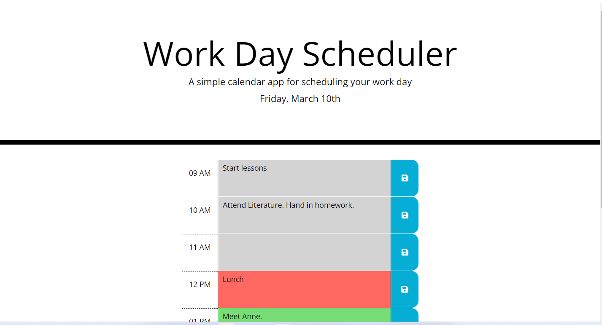

# workd-day-scheduler

Calendar application that allows a user to save events for each hour of the day. The app runs in the browser and feature dynamically updated HTML and CSS powered by jQuery. The application uses the library Momment.js, the rows of the application will change colour reflectiong if the time slot is past, present or future.

## Installation

N/A. Application is ready to use in the deployment website.

## Usage

Enter information into the scheduler using the keyboard, press the 'floppy disk' icon to save the information in localStorage. The information will remain after refreshing the page.
The application can be found deployed and ready to use in the following website:
https://pedrobe9.github.io/workd-day-scheduler/

The code can be found in the following GitHub repository:
https://github.com/Pedrobe9/workd-day-scheduler

A screenshot can be seen underneath.

## Credits

The project was made using W3 wbsite and MND website.
https://www.w3schools.com/
https://developer.mozilla.org/es/

## License

MIT License.

## Badges

N/A.

## Features

Project is made up of only one feature, the scheduler. Ic can perform several functions aside of rendering the rows of the scheduler, it save data to localStorage and retreave the data. It also signalled the time by the color of the rows. The app uses the Moment.js library to work with date and time.

## How to Contribute
N/A.

## Tests

N/A.